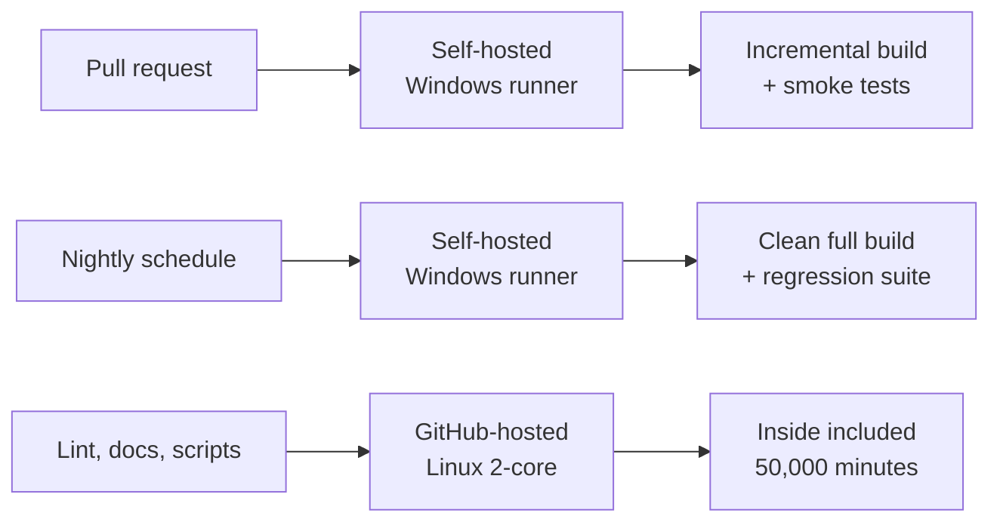

# GitHub Enterprise + Copilot Cost Estimate (5 Developers)

Prepared by @Someone · 2026-09-19 · Migration from CVS to GitHub Enterprise for CAE software development

## Executive summary

Buy 5 GitHub Enterprise seats with **Copilot Business** - not Copilot Enterprise - at **$200/month ($2,400/year)**, set a **$500/month team AI budget**, and run C++ builds on an on-premises runner. Expected all-in run rate is **$482/month ($5,784/year)** for the whole team.

GitHub Support has now confirmed that Copilot Business and Copilot Enterprise have **identical model availability and identical functionality**. The only difference is the included credit allowance, and because each plan's included credits are worth exactly its seat price, Copilot Enterprise can never cost less than Copilot Business. Choosing Business saves **$1,200/year** with no loss of capability.

| Line item | Monthly | Annual | Note |
| --- | --- | --- | --- |
| GitHub Enterprise, 5 seats @ $21 | $105 | $1,260 | 50,000 Actions minutes, 50 GB packages, 250 GiB Git LFS |
| Copilot Business, 5 seats @ $19 | $95 | $1,140 | 9,500 pooled AI credits ($95 of model usage) |
| AI usage above included credits (expected) | $282 | $3,384 | Modelled team mix on a Claude Sonnet / GPT-5.4 class model |
| Repository hosting for the 1.2 GB repo | $0 | $0 | Git storage is not metered |
| CI builds on one on-prem runner | $0 | $0 | Self-hosted runner minutes are not billed |
| **Expected total** | **$482** | **$5,784** |  |
| Same team on Copilot Enterprise | $482 | $5,784 | Identical outcome, $1,200/yr more in licences, $1,200 less in overage |
| Worst case if every budget cap is hit | $1,450 | $17,400 | 5 × $250 AI budget fully consumed |

**Three decisions needed**

1. **Copilot tier.** Take **Copilot Business at $19/seat**, not Copilot Enterprise at $39. Feature parity is confirmed by GitHub Support and by GitHub's own plan documentation, and the arithmetic below shows Business is never the more expensive option at any usage level.
2. **Is GitHub Enterprise worth $1,260/year on its own?** It has to be justified without Copilot: SAML single sign-on, enterprise audit log, IP allow lists, 50,000 Actions minutes and 50 GB packages. For a company whose product is its source code, yes - but that is the question to put to management, not the Copilot tier.
3. **Budget shape.** Credits pool across the organisation, so five separate $250 caps waste the pooling. One $500/month team budget with a $150 per-user ceiling covers modelled demand and is a cap, not a committed spend.

## Where we are today

The CAE product is developed in Visual Studio against a CVS repository, with a codebase of roughly 1.2 GB including bundled third-party libraries. Trials of GitHub Enterprise, GitHub Copilot and Visual Studio 2026 Professional are running now and going well.

| Area | Today | After migration |
| --- | --- | --- |
| Source control | CVS, file-based, no pull requests | Git on GitHub, branch + pull request review |
| Code review | Ad hoc / none enforced | Required reviews, protected branches, audit trail |
| Build | Developer machines, manual | GitHub Actions on a self-hosted Windows runner |
| AI assistance | None | Copilot completions, chat and agent mode in Visual Studio |
| Access control | Server-level accounts | SSO, org roles, audit log, IP allow list |

CVS is no longer actively maintained and has no practical path to modern tooling: Copilot agent mode, automated CI, dependency scanning and pull-request review all assume Git. The migration is therefore a prerequisite for the productivity gains, not a separate project.

One caution worth stating up front: a straight `cvs2git` conversion of a 1.2 GB tree carries the full history of every bundled binary library. That is what makes the repository large, and it is the single item most worth fixing during migration rather than after.

## What a Copilot licence actually includes

GitHub Support calls them "tokens" and the figures they gave you - 1,900 for Business and 3,900 for Enterprise - are correct. In GitHub's billing documentation the same units are called **AI credits**, and they are not tokens in the AI sense. One credit is a unit of money; a token is a unit of text. Keeping the two words apart is what makes the rest of the budget legible.

> **1 AI credit = $0.01 USD.** Included credits always equal the seat price: Copilot Business $19 = 1,900 credits, Copilot Enterprise $39 = 3,900 credits. Credits are then spent against each model's published per-token rate, so **how many tokens one credit buys depends entirely on the model selected** - from 2,000 tokens on Claude Opus to 50,000 on GPT-5.4 nano.

Credits are spent against published per-model token rates, so the number of tokens a credit buys depends entirely on which model the developer selects.

|  | Copilot Business | Copilot Enterprise |
| --- | --- | --- |
| Price per seat / month | $19 | $39 |
| Included AI credits / seat / month (from 1 Sept) | 1,900 | 3,900 |
| Promotional allowance (June-August only) | 3,000 | 7,000 |
| Dollar value of included credits | $19 | $39 |
| Overage rate | $0.01 per credit | $0.01 per credit |
| **Model availability** | **Identical** | **Identical** |
| **Core functionality** | **Identical** | **Identical** |
| Requires GitHub Enterprise | No | **Yes** |
| Purchasable by | Credit card or Azure subscription | Attached to a GitHub Enterprise account |
| Annual invoicing | Not offered | Via the Enterprise agreement |
| Code completions and next-edit suggestions | Unlimited, never billed | Unlimited, never billed |
| Credits roll over | No | No |

The June-August allowances of 3,000 and 7,000 were a promotional top-up that ended on 1 September. Your trial is running on the standard 1,900, and GitHub Support has confirmed that extending the trial does **not** add credits - the extension lengthens the period only.

Four behaviours matter for the budget:

- **Credits are pooled at the billing entity, not per person.** Five Business seats create one shared pool of 9,500 credits a month. A heavy developer draws on credits a lighter colleague did not use.
- **Code completions are free and unlimited on every paid plan.** Only chat, agent mode, the CLI and cloud agents consume credits. Day-to-day autocomplete never touches the budget.
- **Unused credits expire monthly.** No carry-over, so over-provisioning is pure waste.
- **When the pool is exhausted, admins choose:** continue at $0.01/credit against a budget, or block until the next cycle. There is no silent downgrade to a cheaper model.

### How many tokens is one credit?

There is no single answer, because a credit is a cent and models cost different amounts per token. On a mainstream model such as Claude Sonnet 4.6, **one credit buys about 3,333 fresh input tokens, 33,333 cached input tokens, or 667 output tokens**. In a realistic agent-mode mix the blended figure is about **4,650 tokens per credit**.

| Model | 1 credit buys (fresh input) | 1 credit buys (cached input) | 1 credit buys (output) | 1 credit buys (typical agent mix) |
| --- | --- | --- | --- | --- |
| GPT-5.4 nano | 50,000 tokens | 500,000 tokens | 8,000 tokens | \~64,000 tokens |
| Claude Haiku 4.5 | 10,000 | 100,000 | 2,000 | \~13,900 |
| Gemini 3.1 Pro | 5,000 | 50,000 | 833 | \~6,500 |
| GPT-5.4 (default) | 4,000 | 40,000 | 667 | \~5,200 |
| Claude Sonnet 4.5 / 4.6 | 3,333 | 33,333 | 667 | \~4,650 |
| Claude Opus 5 | 2,000 | 20,000 | 400 | \~2,800 |

### What the included allowance actually buys

| Model | Copilot Business (1,900 credits) | Copilot Enterprise (3,900 credits) | Days of heavy use covered (Business / Enterprise) |
| --- | --- | --- | --- |
| Claude Haiku 4.5 | 26.5M tokens | 54.4M tokens | 10.6 / 21.8 |
| Gemini 3.1 Pro | 12.4M | 25.5M | 5.0 / 10.2 |
| GPT-5.4 (default) | 9.9M | 20.4M | 4.0 / 8.2 |
| Claude Sonnet 4.5 / 4.6 | 8.8M | 18.1M | 3.5 / 7.3 |
| Claude Opus 5 | 5.3M | 10.9M | 2.1 / 4.4 |

"Days of heavy use" assumes the 2.49M tokens per day modelled later in this document. On a mainstream model the Business allowance covers three and a half working days and the Enterprise allowance seven - which confirms your original assumption that neither is sufficient on its own.

## Models available: GitHub Enterprise + Copilot vs Copilot Business

**Every model listed below is available on both plans.** GitHub Support stated it directly - "model parity and functionality between the two will be the same" - and GitHub's own plan documentation shows no feature differing between Copilot Business and Copilot Enterprise. Buying GitHub Enterprise unlocks no additional models.

Rates are AI credits per million tokens, from [GitHub's model pricing reference](https://docs.github.com/en/copilot/reference/copilot-billing/models-and-pricing). The last column is the practical number: tokens per credit in a typical agent-mode mix.

| Model | Provider | Input | Cached input | Output | Tokens per credit | On Business | On Enterprise |
| --- | --- | --- | --- | --- | --- | --- | --- |
| GPT-5.4 nano | OpenAI | 20 | 2 | 125 | \~64,000 | Yes | Yes |
| GPT-5 mini | OpenAI | 25 | 2.5 | 200 | \~44,200 | Yes | Yes |
| Raptor mini | GitHub | 25 | 2.5 | 200 | \~44,200 | Yes | Yes |
| Gemini 3 Flash | Google | 50 | 5 | 300 | \~26,200 | Yes | Yes |
| GPT-5.4 mini | OpenAI | 75 | 7.5 | 450 | \~17,500 | Yes | Yes |
| MAI-Code-1-Flash | Microsoft | 75 | 7.5 | 450 | \~17,500 | Yes | Yes |
| Kimi K2.7 Code | Moonshot AI | 95 | 19 | 400 | \~15,000 | Yes | Yes |
| Claude Haiku 4.5 | Anthropic | 100 | 10 | 500 | \~13,900 | Yes | Yes |
| GPT-5.6 Luna | OpenAI | 100 | 10 | 600 | \~13,100 | Yes | Yes |
| Gemini 2.5 Pro | Google | 125 | 12.5 | 1,000 | \~8,800 | Yes | Yes |
| Gemini 3.6 Flash | Google | 150 | 15 | 750 | \~9,600 | Yes | Yes |
| Gemini 3.5 Flash | Google | 150 | 15 | 900 | \~8,700 | Yes | Yes |
| GPT-5.3-Codex | OpenAI | 175 | 17.5 | 1,400 | \~6,300 | Yes | Yes |
| Claude Sonnet 5 (promo rate) | Anthropic | 200 | 20 | 1,000 | \~7,000 | Yes | Yes |
| Grok 4.5 | xAI | 200 | 50 | 600 | \~7,700 | Yes | Yes |
| Gemini 3.1 Pro | Google | 200 | 20 | 1,200 | \~6,500 | Yes | Yes |
| GPT-5.4 (default) | OpenAI | 250 | 25 | 1,500 | \~5,200 | Yes | Yes |
| GPT-5.6 Terra | OpenAI | 250 | 25 | 1,500 | \~5,200 | Yes | Yes |
| Claude Sonnet 4 | Anthropic | 300 | 30 | 1,500 | \~4,650 | Yes | Yes |
| Claude Sonnet 4.5 | Anthropic | 300 | 30 | 1,500 | \~4,650 | Yes | Yes |
| Claude Sonnet 4.6 | Anthropic | 300 | 30 | 1,500 | \~4,650 | Yes | Yes |
| Claude Opus 4.5 | Anthropic | 500 | 50 | 2,500 | \~2,800 | Yes | Yes |
| Claude Opus 4.6 | Anthropic | 500 | 50 | 2,500 | \~2,800 | Yes | Yes |
| Claude Opus 4.7 | Anthropic | 500 | 50 | 2,500 | \~2,800 | Yes | Yes |
| Claude Opus 4.8 | Anthropic | 500 | 50 | 2,500 | \~2,800 | Yes | Yes |
| Claude Opus 5 | Anthropic | 500 | 50 | 2,500 | \~2,800 | Yes | Yes |
| GPT-5.5 | OpenAI | 500 | 50 | 3,000 | \~2,600 | Yes | Yes |
| GPT-5.6 Sol | OpenAI | 500 | 50 | 3,000 | \~2,600 | Yes | Yes |
| Claude Opus 4.8 (fast mode) | Anthropic | 1,000 | 100 | 5,000 | \~1,400 | Yes | Yes |
| Claude Fable 5 | Anthropic | 1,000 | 100 | 5,000 | \~1,400 | Yes | Yes |

Anthropic models also carry a cache-write charge of roughly 1.25x the input rate; that is included in the tokens-per-credit column. Long-context variants of the OpenAI, Google and xAI models are billed at roughly double the standard rate once the input passes the model's long-context threshold.

### What this means for model policy

The spread from top to bottom of this table is **46x**. Model choice, not licence tier, is the dominant cost lever.

| Policy | Default model | Expected cost, 5 developers, 175M tokens/month |
| --- | --- | --- |
| Cost-first | Claude Haiku 4.5 / GPT-5.4 mini | $126 / month |
| Balanced (recommended) | Gemini 3.1 Pro or GPT-5.4 | $267-334 / month |
| Quality-first | Claude Sonnet 4.6 | $377 / month |
| Unconstrained | Claude Opus 5 | $628 / month |

A practical policy: set a mid-tier default, let developers switch to a premium model for genuinely hard solver, numerical or refactoring work, and review the usage dashboard monthly. That captures most of the quality benefit at roughly half the unconstrained cost.

## Purchase options for 5 users

Three options are on the table. The recommended one is the middle row.

| Option | Composition | Per user / month | 5 users / month | 5 users / year |
| --- | --- | --- | --- | --- |
| 1. Copilot only | GitHub Team $4 + Copilot Business $19 | $23 | $115 | $1,380 |
| **2. Enterprise + Business (recommended)** | **GitHub Enterprise $21 + Copilot Business $19** | **$40** | **$200** | **$2,400** |
| 3. Enterprise + Copilot Enterprise | GitHub Enterprise $21 + Copilot Enterprise $39 | $60 | $300 | $3,600 |

| Option | Pooled credits / month | Actions minutes | Packages storage | SSO & audit log |
| --- | --- | --- | --- | --- |
| 1. Copilot only | 9,500 ($95) | 3,000 | 2 GB | No |
| 2. Enterprise + Business | 9,500 ($95) | 50,000 | 50 GB | Yes |
| 3. Enterprise + Copilot Enterprise | 19,500 ($195) | 50,000 | 50 GB | Yes |

### GitHub's own quoted figures, and what they scale to

The examples GitHub Support provided are internally consistent and confirm both unit prices.

| Users | GitHub Enterprise / year | Copilot / year | Total / year | Implied Copilot rate |
| --- | --- | --- | --- | --- |
| 10 | $2,520 | $2,280 | $4,800 | $19 / user / month |
| 50 | $12,600 | $11,400 | $24,000 | $19 / user / month |
| 75 | $18,900 | $17,100 | $36,000 | $19 / user / month |
| **5 (your deployment)** | **$1,260** | **$1,140** | **$2,400** | **$19 / user / month** |

**One correction worth making before this goes to management.** The working estimate of $3,540/year came from reading the $2,280 Copilot line as 5 users at $38. That $2,280 figure is 10 users at $19/user/month - the same number appears in GitHub's "Copilot only" examples, which confirms the quoted Copilot line throughout is Copilot **Business**, not Enterprise. The correct figures for 5 users are **$2,400/year with Copilot Business** or **$3,600/year with Copilot Enterprise**. Neither is $3,540.

### Billing and procurement mechanics

|  | GitHub Enterprise | Copilot Business | Copilot Enterprise |
| --- | --- | --- | --- |
| Annual invoicing | Yes | No - not offered | Via the Enterprise agreement |
| Monthly usage-based billing | Yes | Yes | Yes |
| Payment methods | Invoice, card, Azure | Credit card or Azure subscription only | Through the Enterprise account |
| Standalone purchase | Yes | Yes | **No - requires GitHub Enterprise first** |
| Upgrade path from the current trial | Trial upgrades directly to paid | Direct purchase | Upgrade Enterprise first, then provision |
| Exit path | Annual term applies | Cancel monthly | Remove orgs from the Enterprise account, then downgrade to Business |

Because Copilot Business bills only by card or Azure subscription, finance should decide in advance which of those two routes to use. If the company already has an Azure agreement, routing Copilot through it keeps everything on one invoice even though GitHub does not offer annual invoicing for Business seats.

## Which Copilot tier, and does GitHub Enterprise pay for itself?

These are two separate decisions, and the first one now has a clean answer.

### Copilot Enterprise is never cheaper than Copilot Business

Both plans include credits worth exactly their seat price, both bill overage at $0.01 per credit, and GitHub Support has confirmed the models and functionality are identical. So the monthly cost per seat is simply whichever is larger: the seat price, or what the developer actually consumed.

```latex
\text{Business cost} = \max(\$19,\; U) \qquad \text{Enterprise cost} = \max(\$39,\; U)
```

Where U is the dollar value of that seat's model usage. Since $19 < $39, Business is less than or equal to Enterprise at every possible usage level.

| Seat's actual model usage | Copilot Business cost | Copilot Enterprise cost | Business saving |
| --- | --- | --- | --- |
| $10 (light user) | $19 | $39 | $20 |
| $19 | $19 | $39 | $20 |
| $30 | $30 | $39 | $9 |
| $39 | $39 | $39 | $0 |
| $75 | $75 | $75 | $0 |
| $108 (modelled heavy developer) | $108 | $108 | $0 |
| $200 | $200 | $200 | $0 |

The only thing Copilot Enterprise changes is **when** you pay: more up front, less in overage. It never changes the total, and for any developer using less than $39 of models a month it costs strictly more. Across 5 seats that is up to **$1,200/year of avoidable spend**.

One caveat to raise with GitHub in writing: confirm that the $0.01 overage rate and the per-model rates are the same on both plans. Everything above depends on it.

### Is GitHub Enterprise worth $1,260/year on its own?

With the Copilot tier settled, GitHub Enterprise has to justify itself against GitHub Team at $4/user/month - a difference of **$85/month, $1,020/year** for 5 users.

| Capability | GitHub Team | GitHub Enterprise | Matters for a CAE company? |
| --- | --- | --- | --- |
| SAML/OIDC single sign-on, SCIM provisioning | No | Yes | Yes - centralised joiner/leaver control over source IP |
| Enterprise audit log, IP allow lists | Limited | Yes | Yes - who touched the solver code, and from where |
| Actions minutes included | 3,000 | 50,000 | Only if you use cloud runners |
| Packages storage | 2 GB | 50 GB | Useful once libraries move to a package manager |
| Git LFS storage & bandwidth | 250 GiB | 250 GiB | Same on both |
| Multi-organisation management | No | Yes | Matters as headcount grows past one team |
| Uptime SLA | None | 99.9% | Moderate |
| Larger runners available | Yes | Yes | Same on both |

**Verdict:** $1,020/year is a reasonable price for single sign-on and a real audit trail over a codebase that is the company's core asset. If management pushes back, Option 1 (Team + Copilot Business at $1,380/year) is a defensible starting point, with the caveat that adding SSO later means migrating the enterprise account.

## How many tokens does one C++ developer actually use?

A developer doing 5 hours a day of AI-assisted C++ work plus documentation consumes roughly **50 million tokens a month**, which costs **$95-110 of AI credits** on a mainstream model. That is 2.5x to 2.8x the Copilot Enterprise allowance and 5x to 5.7x the Business allowance.

### Bottom-up daily model

| Activity | Times per day | Tokens per interaction | Daily tokens |
| --- | --- | --- | --- |
| Agent-mode task (implement, refactor, fix build break, write tests) | 6 | \~320,000 | 1,920,000 |
| Copilot Chat question against the codebase | 25 | \~16,500 | 412,500 |
| Documentation / comment generation | 2 | \~46,000 | 92,000 |
| Code review assistance on a pull request | 1 | \~65,000 | 65,000 |
| **Total per developer per day** |  |  | **\~2,490,000** |
| **Total per developer per month** (21 working days) |  |  | **\~52,000,000** |

Agent-mode tasks dominate because each one re-sends the working context on every step. A single agent task on a large C++ file with 10-15 tool calls easily reads 300,000 tokens; only a fraction of that is billed at the full input rate because the rest is served from cache.

### Monthly cost per developer, by intensity and model

| Usage tier | Tokens / month | Haiku 4.5 | Gemini 3.1 Pro | GPT-5.4 | Sonnet 4.5/4.6 | Opus 5 |
| --- | --- | --- | --- | --- | --- | --- |
| Light - 2 h/day, mostly chat | 15M | $11 | $23 | $29 | $32 | $54 |
| Moderate - 3-4 h/day, mixed | 30M | $22 | $46 | $57 | $65 | $108 |
| **Heavy - 5 h/day, agent-first** | **50M** | **$36** | **$76** | **$96** | **$108** | **$179** |
| Very heavy - parallel agents, long refactors | 80M | $57 | $122 | $153 | $172 | $287 |

### Against the included allowance

|  | Copilot Enterprise | Copilot Business |
| --- | --- | --- |
| Included credits per seat | 3,900 ($39) | 1,900 ($19) |
| Heavy developer's monthly need (Sonnet class) | 10,760 credits ($108) | 10,760 credits ($108) |
| Share covered by the licence | 36% | 18% |
| Overage per heavy developer | $69 | $89 |

Your assumption was right: neither allowance is sufficient for a heavy agent-mode C++ developer. The Enterprise allowance covers about ten working days of that pattern; the Business allowance covers about five.

## How efficient is a $250 per developer budget?

A $250 monthly budget is a **cap on overage, not a committed spend**. GitHub bills only what is consumed. Against the modelled heavy developer, $250 is roughly 3.6x more headroom than needed, so the expected invoice is far below the cap.

|  | Copilot Enterprise | Copilot Business |
| --- | --- | --- |
| Included credits | 3,900 | 1,900 |
| Budget credits ($250 @ $0.01) | 25,000 | 25,000 |
| **Total credits available / developer / month** | **28,900** | **26,900** |
| Total dollar value of model usage | $289 | $269 |
| Expected consumption (heavy dev, Sonnet class) | 10,760 credits | 10,760 credits |
| **Budget utilisation** | **27% of the $250** | **36% of the $250** |
| Expected actual overage billed | $69 | $89 |

### Tokens a developer can buy with the full budget

| Model | Enterprise: 28,900 credits | Business: 26,900 credits | Months of heavy use covered |
| --- | --- | --- | --- |
| Claude Haiku 4.5 | 403M tokens | 375M tokens | \~8.0 |
| Gemini 3.1 Pro | 189M tokens | 176M tokens | \~3.8 |
| GPT-5.4 | 151M tokens | 141M tokens | \~3.0 |
| Claude Sonnet 4.5 / 4.6 | 134M tokens | 125M tokens | \~2.7 |
| Claude Opus 5 | 81M tokens | 75M tokens | \~1.6 |

### Why $250 per developer is the wrong shape

Credits pool at the organisation level, so a per-developer cap fragments a shared resource. Five $250 caps create a $1,250 ceiling that nobody will reach, while a single team budget lets the two heavy users draw on what the lighter users leave behind.

Modelling a realistic team of 2 heavy, 2 moderate and 1 light developer - 175M tokens a month in total:

| Model used | Team model spend | Enterprise pool (19,500 cr) | Team overage | Business pool (9,500 cr) | Team overage |
| --- | --- | --- | --- | --- | --- |
| Claude Haiku 4.5 | $126 | covers all | **$0** | partially | $31 |
| Gemini 3.1 Pro | $267 | covers $195 | **$72** | covers $95 | $172 |
| GPT-5.4 | $334 | covers $195 | **$139** | covers $95 | $239 |
| Claude Sonnet 4.5 / 4.6 | $377 | covers $195 | **$182** | covers $95 | $282 |
| Claude Opus 5 | $628 | covers $195 | **$433** | covers $95 | $533 |

**Recommendation:** set one team-level budget of **$500/month** with a per-user ceiling of $150 as a runaway guard. On Copilot Business that covers the Sonnet-class scenario with 77% headroom, costs nothing unless used, and leaves room to run a premium model on a hard problem. Review it after the first full billing cycle and reset it on your own data.

## Total cost of ownership, 5 developers

Two numbers matter for each option: the **budget ceiling** you ask finance to approve, and the **expected spend** you will actually be invoiced.

### With a $250 per-developer AI budget (the ceiling you approve)

| Line item | Opt 1: Team + Copilot Business | Opt 2: Enterprise + Copilot Business | Opt 3: Enterprise + Copilot Enterprise |
| --- | --- | --- | --- |
| Platform licence, 5 users | $20 | $105 | $105 |
| Copilot licence, 5 seats | $95 | $95 | $195 |
| AI budget ceiling, 5 × $250 | $1,250 | $1,250 | $1,250 |
| Repository hosting & LFS | $0 | $0 | $0 |
| CI builds (self-hosted runner) | $0 | $0 | $0 |
| **Maximum monthly cost** | **$1,365** | **$1,450** | **$1,550** |
| **Maximum annual cost** | **$16,380** | **$17,400** | **$18,600** |

### Expected spend at modelled usage (what you will actually pay)

| Line item | Opt 1: Team + Business | Opt 2: Enterprise + Business | Opt 3: Enterprise + Copilot Enterprise |
| --- | --- | --- | --- |
| Platform licence, 5 users | $20 | $105 | $105 |
| Copilot licence, 5 seats | $95 | $95 | $195 |
| AI usage above pooled credits | $282 | $282 | $182 |
| Repository hosting & LFS | $0 | $0 | $0 |
| CI builds (self-hosted runner) | $0 | $0 | $0 |
| **Expected monthly cost** | **$397** | **$482** | **$482** |
| **Expected annual cost** | **$4,764** | **$5,784** | **$5,784** |
| Expected per developer per month | $79 | $96 | $96 |
| Same team on a cost-first model policy | $231 | $316 | $385 |

### Reading the two tables together

- **Options 2 and 3 cost exactly the same at modelled usage.** Copilot Enterprise moves $100/month from the overage line to the licence line and changes nothing else. The moment usage drops - a quiet month, a developer on leave, a cheaper default model - Option 3 becomes the more expensive one. That is the whole case for Copilot Business.
- **The gap between ceiling and expectation is about $970/month.** Presenting only the $1,450 ceiling makes the proposal look three times more expensive than it will be. Present both numbers.
- **Model policy moves the bill more than licence tier does.** Switching the default from Claude Sonnet to Gemini 3.1 Pro takes Option 2 from $482 to $372/month without changing a single licence.
- **Adding a sixth developer** costs $40/month in licences under Option 2, plus that person's AI usage.
- **The AI line is the only variable one.** Licences, hosting and builds are fixed and total $200/month. Everything else in the forecast is consumption you control with a budget and a model policy.

## Repository hosting for the 1.2 GB codebase

**Hosting the repository costs nothing extra.** GitHub does not meter ordinary Git repository storage; there is no per-GB charge for the code itself on any plan. The 1.2 GB tree with all bundled libraries sits comfortably inside GitHub's guidance.

| Item | GitHub's position | Your 1.2 GB repo |
| --- | --- | --- |
| Git repository storage | Not metered, no per-GB billing | $0 |
| Recommended maximum repo size | 10 GB on-disk (`.git` folder) | Well inside |
| Recommended file size | 1 MB per object | Some libraries will exceed |
| **Hard file size limit** | **100 MB per object - pushes are rejected above this** | **Check before migrating** |
| Git LFS storage included (Team & Enterprise) | 250 GiB | $0 |
| Git LFS bandwidth included (Team & Enterprise) | 250 GiB / month | $0 |
| Git LFS storage above the allowance | $0.07 per GiB / month | n/a |
| Git LFS bandwidth above the allowance | $0.0875 per GiB | n/a |
| Packages storage included (Enterprise) | 50 GB | $0 |
| Actions artifact & Packages storage above allowance | $0.25 per GB / month | See build section |

### The one thing to check before migrating

The 100 MB per-file hard limit is enforced on push. If any bundled library binary, sample mesh or test dataset exceeds 100 MB, that push fails and the migration stalls. Run an inventory of the CVS tree for files over 100 MB, and over 50 MB, before the conversion date.

### If you move libraries to Git LFS

| Scenario | LFS storage used | LFS bandwidth / month | Monthly cost |
| --- | --- | --- | --- |
| Libraries in Git, no LFS (today's plan) | 0 GiB | 0 GiB | $0 |
| \~800 MB of libraries in LFS, 5 devs × 4 fresh clones/month | \~1 GiB (plus version history) | \~16 GiB | $0 |
| LFS grows to 300 GiB of history over 3 years | 300 GiB | 400 GiB / month | \~$16.60 |

Even a pessimistic LFS growth path stays under $20/month. **Cost is not the reason to choose between Git LFS and Artifactory.** The reasons are clone time and developer experience: a 1.2 GB clone with full binary history can take 10-20 minutes on a slow link and bloats every developer's disk, while LFS fetches only the versions actually checked out.

A practical recommendation: keep the code in Git, move bundled third-party libraries to a package manager (vcpkg or Conan backed by Artifactory if you already own it, otherwise GitHub Packages inside the 50 GB allowance), and use Git LFS only for large binary test assets such as reference meshes and result files.

## Cost of running CAE builds on GitHub-hosted runners

Cloud runners are billed per minute and C++ builds are minute-hungry. At a realistic build volume the charge lands between **$98 and $807 a month** depending on runner size, and the standard 2-core runners are too slow to be usable for a CAE codebase.

### Modelled build volume

| Workload | Runs per month | Minutes per run | Minutes per month |
| --- | --- | --- | --- |
| Pull-request build + smoke tests | 168 (8/day) | 40 | 6,720 |
| Nightly full build + regression suite | 21 | 120 | 2,520 |
| Release / installer build | 4 | 150 | 600 |
| **Total** |  |  | **9,840** |

### Monthly cost at that volume

| Runner | Rate / minute | Monthly cost | Suitable for a 1.2 GB C++ CAE build? |
| --- | --- | --- | --- |
| Windows 2-core (standard) | $0.010 | $98 | No - build times would be 2-3x the model |
| Windows 4-core (larger) | $0.022 | $216 | Marginal |
| Windows 8-core (larger) | $0.042 | $413 | Yes, realistic choice |
| Windows 16-core (larger) | $0.082 | $807 | Yes, fastest |
| Linux 8-core (larger) | $0.022 | $216 | Only if you also target Linux |
| Linux 16-core (larger) | $0.042 | $413 | Only if you also target Linux |

### Two traps in the included-minutes allowance

1. **Larger runners are always billed.** GitHub's documentation is explicit: larger runners are charged even when plan quota remains. The 50,000 Enterprise minutes only apply to standard 2-core runners, which are the ones too slow for this build.
2. **Minute multipliers.** Historically Windows minutes consumed the included allowance at 2x and macOS at 10x. Confirm the current rule with GitHub before relying on the 50,000-minute figure, because at 2x it is effectively 25,000 Windows minutes.

On top of runner minutes, build artifacts and packages are billed at **$0.25 per GB/month** above the 50 GB Enterprise allowance, and Actions cache at **$0.07 per GB/month**. A CAE build producing 500 MB of artifacts per run with 30-day retention would consume roughly 80 GB, costing about **$7.50/month** beyond the allowance.

**Realistic cloud-only build budget: $420-500 per month, $5,000-6,000 per year.** That is comparable to the entire Copilot licence spend.

## On-premises runners for C++ CAE builds

**Yes - on-prem runners are both cheaper and technically better for this workload.** GitHub charges nothing for minutes executed on self-hosted runners, regardless of volume. At the modelled build load an on-prem runner saves about **$271/month in cash**, and new hardware pays for itself in under 13 months.

### Cost comparison at 9,840 build minutes per month

|  | GitHub-hosted Windows 8-core | Self-hosted Windows 16-core |
| --- | --- | --- |
| Actions minute charges | $413 / month | $0 |
| Hardware (16-core, 64 GB RAM, 2 TB NVMe) | — | $3,500 capex, \~$97/month over 3 years |
| Electricity (\~250 W average) | included | \~$22 / month |
| Rack space, network, UPS | included | \~$20 / month |
| Administration (\~2 h/month) | — | \~$100 / month |
| **Total monthly cost** | **$413** | **$239** |
| **Monthly cash saving** |  | **$271** (excluding capex) |
| **Payback on new hardware** |  | **12.9 months** |
| **Annual saving from year 2** |  | **$3,252** |

If you repurpose an existing machine, the saving starts immediately.

### Break-even build volume

| Cloud runner you would otherwise use | Break-even, new $3,500 machine | Break-even, repurposed machine |
| --- | --- | --- |
| Windows 4-core | 182 h/month | 46 h/month |
| Windows 8-core | 95 h/month | 24 h/month |
| Windows 16-core | 49 h/month | 12 h/month |

Your modelled load is **164 hours a month**, comfortably past every break-even point.

### The technical argument is stronger than the cost argument

GitHub-hosted runners are ephemeral: every job starts from a clean image, so every build is a **full rebuild** and every run re-downloads the 1.2 GB repository plus all dependencies. A persistent self-hosted runner keeps the working tree, the object files and the compiler cache between builds.

| Factor | GitHub-hosted | Self-hosted |
| --- | --- | --- |
| Incremental C++ builds | Not possible - clean image each run | Yes, typically 4-8x faster |
| 1.2 GB repo checkout | Full clone every run | Warm working tree |
| Licensed CAE / third-party SDKs on the runner | Must install per run or bake a custom image | Installed once |
| Visual Studio toolchain | Preinstalled versions only | Exactly the version developers use |
| GPU / large-memory solver tests | Limited, expensive | Whatever hardware you buy |
| Scaling to many parallel jobs | Instant | Limited to machines you own |
| Maintenance burden | None | Patching, disk, agent upgrades |
| Availability during office moves / outages | GitHub's SLA | Your responsibility |

### Recommended hybrid setup



Run everything that touches the C++ toolchain on the self-hosted Windows runner, and keep lightweight jobs - linting, markdown checks, release notes, issue automation - on GitHub-hosted Linux runners where they fit inside the included allowance at no cost.

One security note: self-hosted runners are safe for private repositories but should never be attached to a public repository, because a fork's pull request could execute arbitrary code on your network. Keep the CAE repository private and restrict runner groups to that repository.

## Recommendation and rollout

Buy GitHub Enterprise with Copilot **Business**, budget at the team level, build on-premises.

| # | Action | Cost | Timing |
| --- | --- | --- | --- |
| 1 | Ask GitHub to confirm in writing that overage and per-model rates are identical on Business and Enterprise | — | Before signing |
| 2 | Upgrade the existing trial to a paid GitHub Enterprise subscription, 5 seats | $105 / month | On trial expiry |
| 3 | Provision 5 **Copilot Business** seats, not Copilot Enterprise | $95 / month | Same |
| 4 | Decide the Copilot payment route: credit card or Azure subscription | — | Before purchase |
| 5 | Set one team AI budget of $500/month, per-user ceiling $150, alerts at 50/75/90% | $0 until used | Day 1 of billing |
| 6 | Set a mid-tier default model; allow opt-up per task | — | Day 1 |
| 7 | Inventory the CVS tree for files over 100 MB | 1 day of effort | Before migration |
| 8 | Convert CVS to Git with history; keep libraries in place for now | 3-5 days | Month 1 |
| 9 | Stand up one self-hosted Windows build runner | $3,500 capex or reuse hardware | Month 1 |
| 10 | Move bundled libraries to vcpkg/Conan or Artifactory | 2-3 weeks | Month 2-3 |
| 11 | Review actual credit consumption and re-set the budget | — | End of month 1, then quarterly |

### Guardrails to put in place on day one

- **Enable the enterprise budget with alerts at 50%, 75% and 90%.** This is the single control that prevents a surprise invoice.
- **Set a default model.** Model choice drives a 46x cost spread across the catalogue and a 3x spread across the models people will realistically pick. Defaulting to Gemini 3.1 Pro or GPT-5.4 and reserving Claude Opus for genuinely hard solver or numerical work is the largest lever you have.
- **Turn on the Copilot usage dashboard** and review it monthly for the first quarter, so month 4's budget is set on your own data rather than this model.
- **Do not cap per developer at first.** Set the per-user ceiling high enough ($150) that it only catches runaway automation, and let the pool do its job.
- **Keep the downgrade path open.** GitHub Support confirmed that if Enterprise turns out not to be worth it, you remove the organisations from the Enterprise account and fall back to Copilot Business standalone. Since you are already on Copilot Business, that exit costs nothing in Copilot terms.

### What to defer

Hold off on GitHub Advanced Security, Codespaces and any multi-year commitment until after two full billing cycles. You will have real consumption data by then, and GitHub's AI credit economics are explicitly described as adapting over time - a long commitment locks you into today's rates in both directions.

## Assumptions and risks

Every figure above traces to one of these inputs. Challenge the inputs, not the arithmetic.

| Assumption | Value used | Confidence | If wrong |
| --- | --- | --- | --- |
| Working days per month | 21 | High | Linear effect on AI cost |
| Agent-mode tasks per developer per day | 6 | **Medium** | ±2 tasks = ±$22/developer/month |
| Tokens per agent task | 320,000 | **Medium** | The biggest single uncertainty |
| Share of input served from cache | 70% | Medium | At 50% cache, heavy dev cost rises to \~$140 |
| Output share of total tokens | 7% | High | Output is the most expensive component |
| Default model | Sonnet 4.5 / 4.6 class | Low - a policy choice | 5x spread between Haiku and Opus |
| Team mix | 2 heavy, 2 moderate, 1 light | Medium | All-heavy team: overage rises to \~$343/month |
| Build minutes per month | 9,840 | **Medium** | Only matters if you choose cloud runners |
| Repository size | 1.2 GB including libraries | Given | No cost effect either way |
| Build server hardware | $3,500, 3-year life | Medium | ±$1,000 shifts payback by \~4 months |
| Administration effort | 2 h/month @ $50/h | Medium | Understated if no one owns the runner |

### Risks to flag to management

1. **The Copilot Business recommendation rests on one unverified detail.** GitHub Support confirmed model parity and functional parity, and GitHub's documentation agrees. What has not been confirmed in writing is that the **overage rate and per-model rates are identical on both plans**. Get that in writing before purchase; if Enterprise were to bill overage more cheaply, the conclusion would change.
2. **AI credit rates are not contractually fixed.** GitHub describes the flex allotment as designed to adapt as AI economics evolve, and the June-August promotional allowances of 3,000 and 7,000 credits have already been withdrawn. Budget annually, not for three years.
3. **The trial is running on the reduced allowance.** GitHub Support confirmed the 10-day extension adds no credits and that seats carry 1,900. Any productivity impression formed during the promotional period was formed on a larger allowance than you will have in production.
4. **Token consumption estimates carry the widest error bar in this document.** Real usage could plausibly be half or double the model. The team-level budget with alerts is the control that makes this survivable - run one month and re-forecast.
5. **GitHub Enterprise pricing is advertised as a first-12-months rate in some places.** Get the renewal price in writing before signing an annual agreement.
6. **Copilot Business cannot be invoiced annually.** It bills by credit card or Azure subscription only. If finance requires a single annual invoice, that is an argument for routing it through an existing Azure agreement, or for Copilot Enterprise despite the cost - a process reason, not a technical one.
7. **Windows minute multipliers on the included Actions allowance need confirming with GitHub.** The recommendation to use self-hosted runners makes this moot.
8. **Migration effort is not costed here.** CVS-to-Git conversion, build pipeline authoring and team training are real engineering days and should be estimated separately.
9. **Productivity gain is not quantified here.** If Copilot saves each developer 3 hours a week at a $50/hour loaded rate, that is $3,000/month of recovered capacity against an expected $482/month of cost. That ratio, not the licence price, is the actual business case.

### Sources

- GitHub Support correspondence with Donovan Borje - unit prices, the 10/50/75-user pricing examples, standard and promotional credit allowances, trial extension terms, model and functional parity between Business and Enterprise, and the Copilot Enterprise prerequisite and downgrade path
- [GitHub pricing](https://github.com/pricing) - plan prices and included allowances
- [Copilot plans](https://docs.github.com/en/copilot/get-started/plans) - seat prices, included AI credits, and the Business/Enterprise feature comparison
- [Copilot is moving to usage-based billing](https://github.blog/news-insights/company-news/github-copilot-is-moving-to-usage-based-billing/) - the AI credit model and the $0.01 credit value
- [Usage-based billing for organizations and enterprises](https://docs.github.com/copilot/concepts/billing/usage-based-billing-for-organizations-and-enterprises) - credit pooling and budgets
- [Models and pricing for GitHub Copilot](https://docs.github.com/en/copilot/reference/copilot-billing/models-and-pricing) - per-model credit rates
- [Actions runner pricing](https://docs.github.com/en/billing/reference/actions-runner-pricing) - per-minute runner rates
- [GitHub Actions billing](https://docs.github.com/en/billing/concepts/product-billing/github-actions) - included minutes, storage rates, self-hosted runners
- [Git LFS billing](https://docs.github.com/billing/managing-billing-for-git-large-file-storage/about-billing-for-git-large-file-storage) and [metered LFS rates](https://github.blog/changelog/2024-06-03-new-enterprise-accounts-have-metered-billing-for-git-lfs/)
- [Repository limits](https://docs.github.com/en/repositories/creating-and-managing-repositories/repository-limits) - file and repo size guidance

All prices in USD, as of the date in the byline.

## Questions management will ask

**Why are we paying twice - once for GitHub and once for Copilot?** They are separate products. GitHub Enterprise is where the code lives and how access is controlled. Copilot is the AI assistance inside Visual Studio. Copilot Business can be bought without GitHub Enterprise; Copilot Enterprise cannot.

**Is the $250 per developer an actual cost?** No. It is a spending cap. GitHub bills only credits consumed. At modelled usage the team will use about $282/month of the $1,250 ceiling, so the expected invoice is roughly a quarter of the cap.

**What happens if a developer burns through the budget mid-month?** You choose the behaviour in advance. Either usage stops until the next cycle, or it continues and bills at $0.01 per credit. Code completions keep working either way, because they are unlimited and never billed.

**Why are we buying Copilot Business rather than Copilot Enterprise?** Because Enterprise costs $20 more per seat and delivers exactly $20 more in credits, with identical models and identical features. GitHub Support stated the parity directly and GitHub's own plan documentation shows no feature difference. Enterprise can never come out cheaper, and for any developer using less than $39 of models a month it is strictly more expensive. Across 5 seats that is up to $1,200 a year of avoidable spend.

**Then why buy GitHub Enterprise at all?** For single sign-on, the enterprise audit log, IP allow lists, 50,000 Actions minutes and 50 GB of package storage. It has to justify itself on those grounds, not on Copilot. The net premium over GitHub Team is $1,020/year.

**Our earlier estimate was $3,540/year. Why has it changed?** That figure read GitHub's $2,280 Copilot line as 5 users at $38/seat. It is actually 10 users at $19/seat - the same number appears in GitHub's "Copilot only" examples, which confirms the quoted Copilot rate throughout is Business. For 5 users the correct figures are $2,400/year with Copilot Business or $3,600/year with Copilot Enterprise.

**GitHub Support called them tokens. This document calls them credits. Which is it?** The same thing. GitHub's billing documentation calls the unit an AI credit and fixes it at $0.01. It is a unit of money, not a unit of text. The number of actual tokens it buys ranges from 2,000 on Claude Opus to 50,000 on GPT-5.4 nano, which is why model policy matters more than licence tier.

**We saw 3,000 and 7,000 credits during the trial. Where did they go?** Those were promotional allowances for June, July and August. They reverted to the standard 1,900 and 3,900 on 1 September. GitHub Support also confirmed that extending the trial adds no credits - it only extends the period. Budget on the standard allowance.

**Do we get more AI models if we buy GitHub Enterprise?** No. Every model in the catalogue is available on both plans, at the same credit rates. GitHub Support put it as "model parity and functionality between the two will be the same".

**Can we start with fewer than 5 licences?** Yes. Seats are monthly and can be added or removed. Starting with 3 heavy users and adding the rest after a month is a reasonable de-risking step, though it delays the migration benefit for the whole team.

**Our repository is 1.2 GB - what does GitHub charge to host it?** Nothing. Git repository storage is not metered. The only storage charges are Git LFS above 250 GiB, Packages above 50 GB, and Actions artifacts above 50 GB. None of those are triggered by a 1.2 GB codebase.

**Will the 1.2 GB repository even work on GitHub?** Yes, it is well within GitHub's 10 GB guidance. The one blocker is the 100 MB per-file hard limit - any single library binary above that will be rejected on push, which is why the file inventory is step 5 of the rollout.

**Should we move libraries to Git LFS or Artifactory?** Not for cost reasons - both are effectively free at this scale. Do it for clone times and developer experience. The preferred order is: third-party libraries into a package manager, large binary test assets into Git LFS, source code stays in Git.

**Why on-prem build runners rather than the cloud?** Two reasons. GitHub charges nothing for self-hosted runner minutes, saving about $271/month. More importantly, cloud runners are wiped between jobs, so every C++ build is a full rebuild. A persistent runner does incremental builds, typically 4-8x faster.

**What if the on-prem runner goes down?** Builds queue until it comes back. Mitigate by keeping a second runner registered - a spare workstation is enough - and by keeping lightweight jobs on GitHub-hosted runners so the pipeline is never fully dependent on one machine.

**How do we know these token estimates are right?** We do not, and that is stated plainly in the assumptions. This is a bottom-up model, not measured data. The trial is already running, so one month of real Copilot usage dashboard data will replace the model. Budget for month 1 using this document, then re-forecast.

**What is the return on this spend?** Expected cost is $482/month for the team. If Copilot saves each developer three hours a week at a $50/hour loaded rate, that is about $3,000/month of recovered engineering capacity - roughly 6x the cost. The migration off CVS has its own return in code review, traceability and build automation that is not quantified here.

**Can we cancel if it does not work out?** Yes, and GitHub Support has set out the path. Copilot Business seats bill monthly by card or Azure subscription and can be dropped. If GitHub Enterprise proves not to be worth it, you remove the organisations from the Enterprise account and continue on Copilot Business standalone - and because we are recommending Business from the start, that exit costs nothing on the Copilot side. The repository itself is standard Git and can be moved to any other host without data loss. The one commitment to watch is an annual GitHub Enterprise agreement, which is why the renewal price should be confirmed before signing.

**How do we pay for Copilot Business?** Credit card or Azure subscription only - GitHub does not offer annual invoicing for Business seats. If a single annual invoice is a hard requirement from finance, routing Copilot through an existing Azure agreement is the cleanest answer, and it is one of the few genuine arguments for Copilot Enterprise instead.

**What are we not paying for that we might need later?** GitHub Advanced Security (secret and dependency scanning for a C++ codebase), Codespaces, and additional Actions capacity if the team grows. All three are add-ons that can be enabled later without re-architecting anything.
