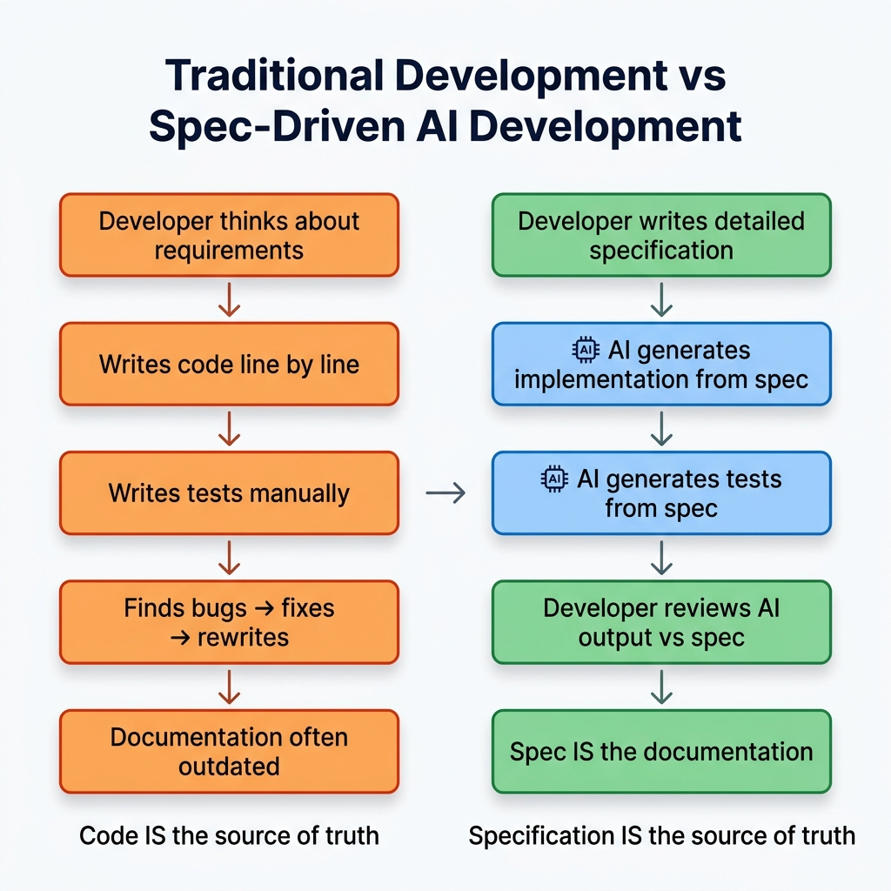
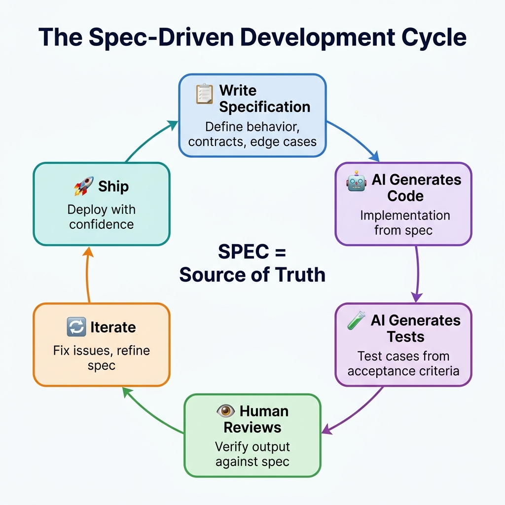
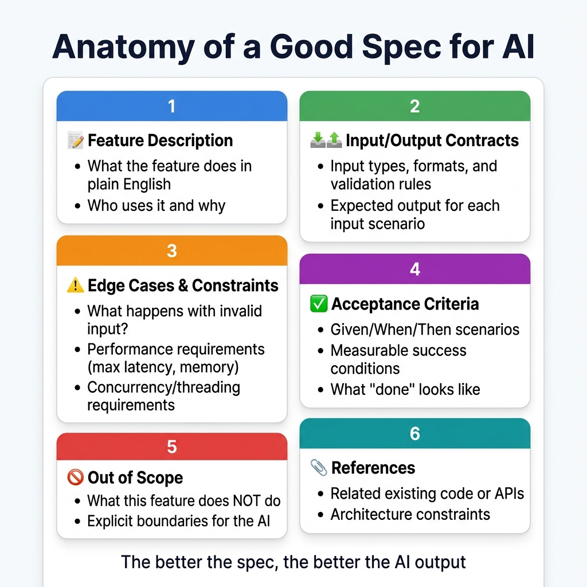
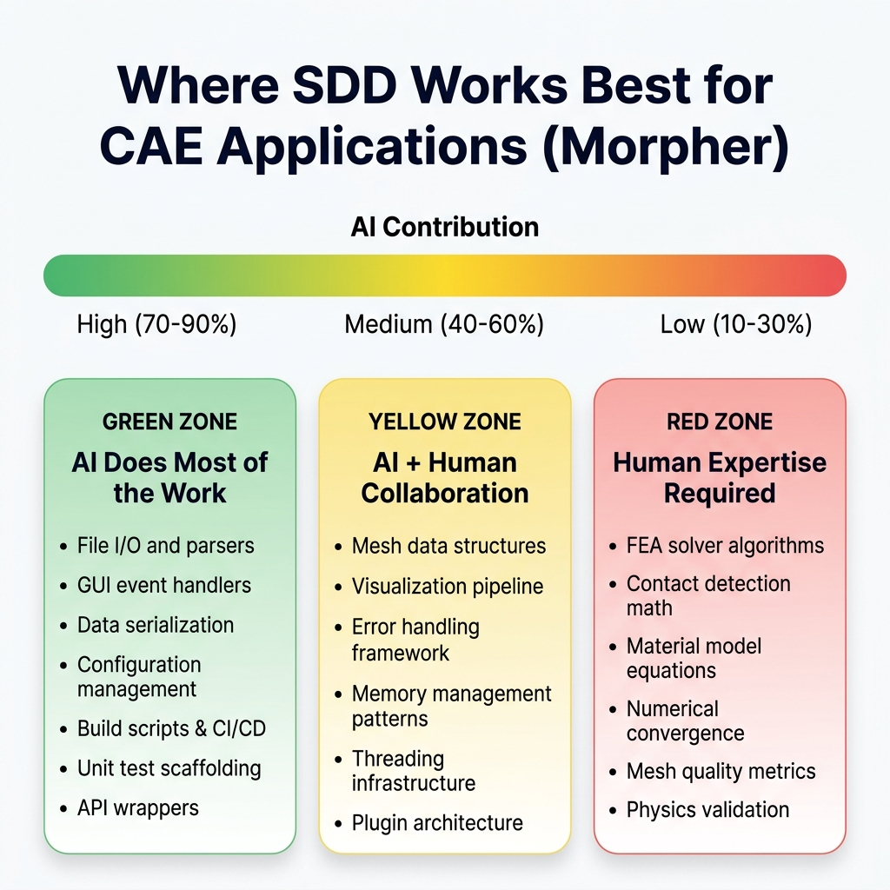
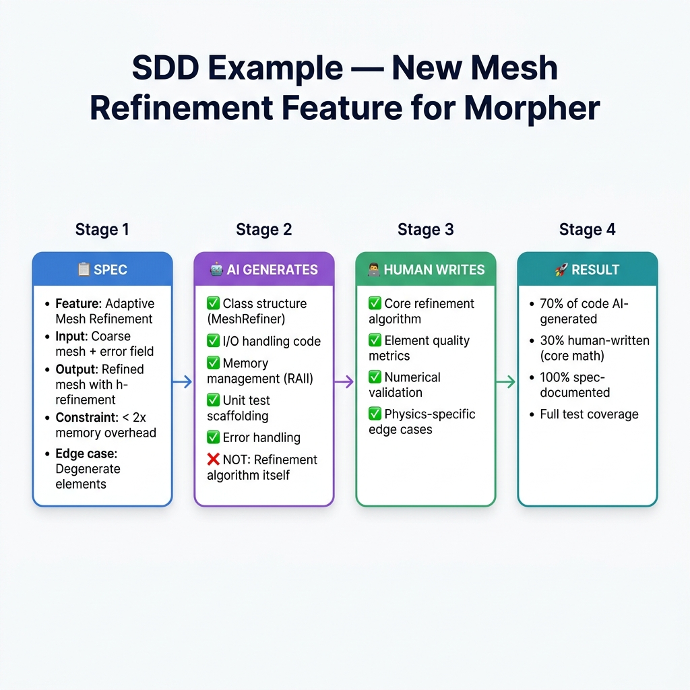
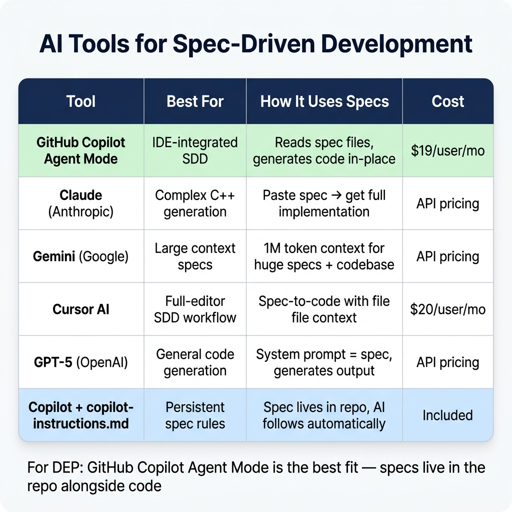
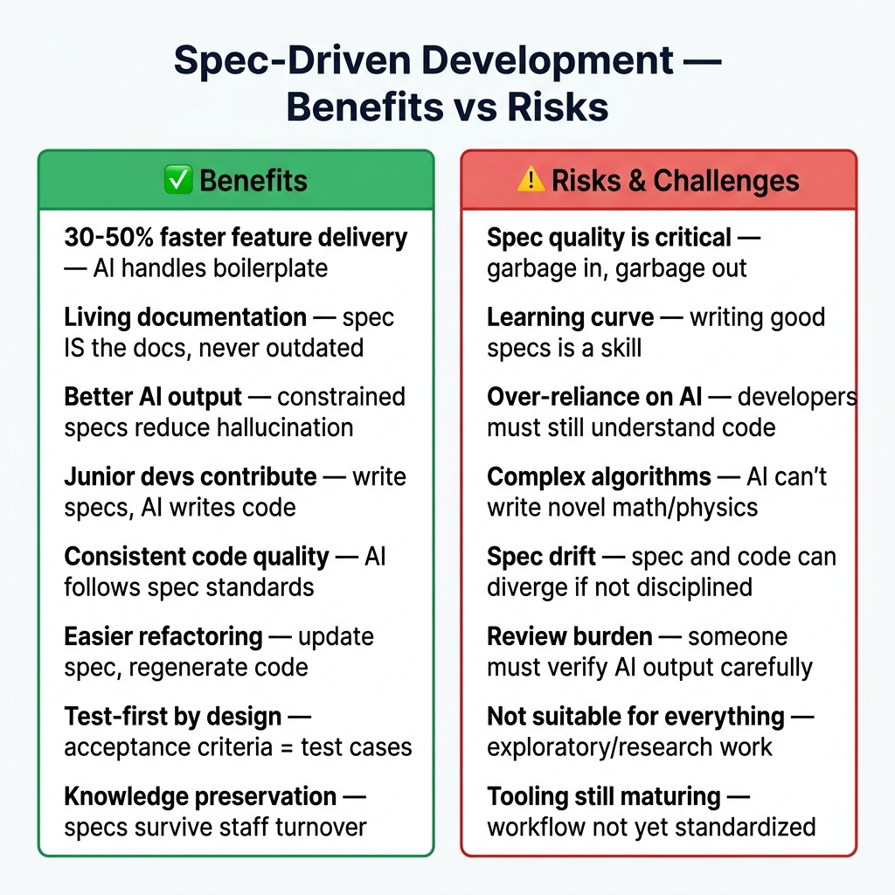

# Spec-Driven Development Using AI
## A Practical Guide

> **Prepared for:** Engineering Team  
> **Date:** July 2026  
> **Read time:** 15 minutes  
> **Focus:** How specifications + AI can accelerate application development

---

## 1. What Is Spec-Driven Development?

**Spec-Driven Development (SDD)** is a modern software development approach where developers write a **detailed specification first** — describing *what* the software should do — and then use **AI to generate the implementation** from that spec.

Instead of the developer being the primary code writer, the developer becomes the **architect and reviewer**, while AI handles the heavy lifting of implementation.

> **The key insight:** AI produces dramatically better code when given a clear, structured specification rather than a vague prompt. Think of it as the difference between giving a contractor a detailed blueprint vs. saying "build me a house."

### The Paradigm Shift



**In traditional development**, the code IS the source of truth. Documentation is written after (if at all) and quickly becomes outdated.

**In spec-driven development**, the specification IS the source of truth. Code is generated from it, tests are derived from it, and the spec itself serves as living documentation.

---

## 2. The SDD Workflow

### The Development Cycle



### Step-by-Step Breakdown

**Step 1: Write the Specification**
- Define the feature in plain English
- List all inputs, outputs, and their types
- Describe edge cases and error handling
- Write acceptance criteria (Given/When/Then)
- State what is explicitly out of scope

**Step 2: AI Generates Code**
- Feed the spec to an AI tool (Copilot Agent Mode, Claude, etc.)
- AI produces implementation code following the spec
- AI generates class structures, error handling, I/O code
- Code follows your project's style (via `copilot-instructions.md`)

**Step 3: AI Generates Tests**
- Acceptance criteria from the spec become test cases
- AI generates unit tests, edge case tests, integration tests
- Tests verify the implementation against the spec

**Step 4: Human Reviews**
- Developer reviews AI output against the original spec
- Verifies correctness, performance, and adherence to standards
- Catches anything AI got wrong (especially domain-specific logic)

**Step 5: Iterate**
- Fix issues found in review
- Refine the spec if requirements changed during review
- Regenerate specific sections as needed

**Step 6: Ship**
- Deploy with confidence — spec-documented, AI-generated, human-verified

---

## 3. Anatomy of a Good Spec

The quality of AI output is directly proportional to the quality of your spec. Here's what a good spec contains:



### Example: Spec for a Mesh Export Feature

```markdown
# Spec: NASTRAN Bulk Data Export

## Feature Description
Export the current FE mesh to NASTRAN Bulk Data Format (.bdf).
Used by analysts who need to run application meshes in external solvers.

## Input/Output Contracts
- **Input:** `MeshModel` object (nodes, elements, materials, properties)
- **Output:** `.bdf` file conforming to NASTRAN Bulk Data Format specification
- **Supported elements:** CTRIA3, CTRIA6, CQUAD4, CQUAD8, CTETRA, CHEXA
- **Max mesh size:** 10 million nodes (must handle without OOM)

## Edge Cases & Constraints
- Empty mesh → write valid header-only file + warning
- Elements with invalid node references → skip + log warning
- Duplicate node IDs → renumber automatically
- Memory: streaming write (don't buffer entire file in memory)
- Thread safety: must be callable from any thread

## Acceptance Criteria
- Given a mesh with 1M nodes and 500K elements
  When exported to .bdf
  Then the file can be imported back into the application identically
- Given an element with node ID = -1
  When exported
  Then the element is skipped and a warning is logged

## Out of Scope
- Does NOT handle result data (stress, strain) — only mesh
- Does NOT validate NASTRAN compatibility of material definitions
- Does NOT support free-field format (fixed-field only)

## References
- See `src/io/NastranReader.cpp` for the existing import code
- NASTRAN Bulk Data Format spec: internal wiki page
```

> **Why this spec is good:** It tells the AI exactly what to build, what to skip, what errors to handle, and how to verify the result. The AI can generate 80%+ of the implementation from this spec alone.

---

## 4. SDD Applied to the application (C++ CAE)

### Where SDD Works Best

Not all parts of a CAE application benefit equally from SDD. Here's a realistic assessment:



### Concrete Example: New Feature for the application



### What This Means in Practice

For a typical new feature in the application:

**Without SDD (Today):**
- 1 senior developer writes everything: boilerplate, I/O, tests, core algorithm
- Takes 5 weeks
- Tests are written after (if time permits)
- Documentation is a JIRA ticket

**With SDD:**
- Developer spends 2–3 days writing a detailed spec
- AI generates boilerplate, I/O, memory management, test scaffolding (~3–5 days of AI work, done in minutes)
- Developer focuses on the core algorithm (~2 weeks)
- Developer reviews AI output (~2–3 days)
- **Total: ~3 weeks** — with better tests and documentation

**Time saved: ~40%** — and the feature is better documented.

---

## 5. How SDD Works with GitHub Copilot

### Copilot Agent Mode = Built-in SDD

GitHub Copilot's **Agent Mode** (available in VS 2022 17.12+) is essentially an SDD tool:

1. **You write a spec** → as a markdown file or a detailed chat prompt
2. **Copilot reads the spec** → understands requirements, constraints, and acceptance criteria
3. **Copilot generates code** → creates files, classes, functions following the spec
4. **Copilot generates tests** → derives test cases from acceptance criteria
5. **You review** → accept, modify, or regenerate

### Using `copilot-instructions.md` as a Persistent Spec

Your `.github/copilot-instructions.md` file acts as a **global specification** that Copilot follows for ALL code generation. This is SDD at the project level:

```markdown
# Application Copilot Instructions (Persistent Spec)

## Memory Management
- Use RAII patterns for all resource allocation
- Prefer std::unique_ptr over raw new/delete
- Use std::vector instead of raw arrays

## Error Handling
- All public functions must validate input parameters
- Use our ErrorLogger for warnings, throw AppException for errors
- Never use exit() or abort() — always throw

## Threading
- All mesh operations must be thread-safe
- Use our ThreadPool class for parallelism
- Never use raw std::thread

## File I/O
- All file operations must use streaming (no full-file buffering)
- Support files > 2GB (use 64-bit file offsets)
- Always validate file headers before reading
```

Every time Copilot generates code for the application, it follows these specs automatically.

### Feature-Level Specs with `.github/instructions/`

For specific modules, create path-specific instruction files:

```markdown
# .github/instructions/solver.instructions.md
---
applyTo: "src/solver/**"
---

## Solver Module Spec
- All matrix operations must use our SparseMatrix class
- Convergence checks are mandatory in every iterative method
- Memory allocation for large matrices must use our PoolAllocator
- All solver functions must accept a ProgressCallback parameter
```

---

## 6. AI Tools for Spec-Driven Development



### Recommended Workflow for your organization

1. **Write specs** in markdown files in the repo (e.g., `specs/feature-name.md`)
2. **Use Copilot Agent Mode** in Visual Studio to generate from specs
3. **Use Claude Sonnet** (via Copilot model selection) for complex C++ generation
4. **Use Gemini 2.5 Pro** when the spec + codebase context is very large
5. **Store specs permanently** — they become documentation

---

## 7. Benefits and Risks



### The Critical Rule for CAE Software

> **Specs describe WHAT, not HOW.**
>
> For the application, the spec says *"solve the linear system Kx = F"* — the AI generates the solver infrastructure (memory allocation, error handling, progress reporting). But the **actual numerical algorithm** (conjugate gradient, direct solver, multigrid) is still designed and validated by the human engineer.

### When NOT to Use SDD

- **Exploratory prototyping** — when you don't know what you're building yet
- **One-line bug fixes** — overkill for simple patches
- **Performance tuning** — requires profiling, not specification
- **Pure research** — novel algorithms need human creativity first
- **Existing code refactoring** — AI works better on greenfield

---

## 8. Getting Started with SDD at your organization

### Phase 1: Learn the Pattern (Weeks 1–2)
- Pick a small, well-defined feature (e.g., a new file format exporter)
- Write a spec following the template above
- Use Copilot Agent Mode to generate the implementation
- Compare time spent vs. traditional development

### Phase 2: Standardize (Weeks 3–4)
- Create a spec template for application features
- Add `copilot-instructions.md` to the repo (global spec)
- Add module-specific instruction files for solver, mesh, I/O
- Train the team on writing effective specs

### Phase 3: Scale (Month 2+)
- Use SDD for all new features
- Build a library of specs (they become documentation)
- Track metrics: time-to-feature, test coverage, defect rate
- Iterate on spec templates based on what works

### Spec Template for the application

```markdown
# Spec: [Feature Name]

## Overview
[1-2 sentence description of what this feature does]

## Context
[Why this feature is needed, who uses it]

## Input/Output
- **Input:** [types, formats, constraints]
- **Output:** [types, formats, expected behavior]

## Behavior
[Detailed description of how the feature should work]

## Edge Cases
- [Edge case 1] → [expected behavior]
- [Edge case 2] → [expected behavior]

## Performance Requirements
- [Max memory, max time, threading model]

## Acceptance Criteria
- Given [condition], When [action], Then [expected result]
- Given [condition], When [action], Then [expected result]

## Out of Scope
- [What this feature does NOT do]

## Dependencies
- [Required classes, libraries, or modules]

## References
- [Links to related code, docs, or specs]
```

---

## 9. SDD vs Other Development Approaches

### How SDD Compares

| Approach | Who Writes Code | Source of Truth | AI Role | Best For |
|----------|:-:|:-:|:-:|:-:|
| **Traditional** | Developer | Code | None | Legacy, no AI |
| **AI-Assisted** | Developer + AI | Code | Copilot suggestions | Most teams today |
| **Spec-Driven (SDD)** | AI (reviewed by human) | **Specification** | Primary author | New features |
| **Test-Driven (TDD)** | Developer | Tests | Optional | Algorithm-heavy |
| **SDD + TDD** | AI (guided by spec + tests) | **Spec + Tests** | Primary author | Best of both |

### SDD + TDD = The Future

The most powerful approach combines both:

1. **Write the spec** (what the feature does)
2. **Write the tests** (from acceptance criteria)
3. **AI generates code** (that passes the tests AND follows the spec)
4. **Human validates** (domain expertise on the 30% AI can't do)

This is where tools like Copilot Agent Mode are heading — and why GitHub + Copilot is the right infrastructure investment for your organization.

---

## 10. Key Takeaways

1. **SDD shifts the developer's role** from code writer to architect/reviewer
2. **The spec is the source of truth** — code and tests are derived from it
3. **AI produces dramatically better output** from detailed specs vs. vague prompts
4. **For the application:** AI can handle 60–70% of code (boilerplate, I/O, tests), humans handle the remaining 30–40% (physics, math, algorithms)
5. **Start small** — pick one new feature, write a spec, let AI generate
6. **Copilot Agent Mode + copilot-instructions.md** = built-in SDD infrastructure
7. **Specs become documentation** — always in sync, never outdated

> **Bottom line:** Spec-Driven Development doesn't replace engineers — it lets them focus on the **hard, interesting problems** (FEA math, solver design, numerical methods) while AI handles the **necessary but routine work** (I/O, serialization, error handling, test scaffolding).

---

> *This document is part of the the migration documentation suite. See also:*
> - *[Migration Briefing](GITHUB-Briefing-Migration-Proposal.md)*
> - *[Copilot C++ Review & Cost Guide](Copilot-CPP-Review-Models-Cost-Guide.md)*
> - *[Technical Q&A — 75+ Questions](Technical-QA-Team-Discussion.md)*
